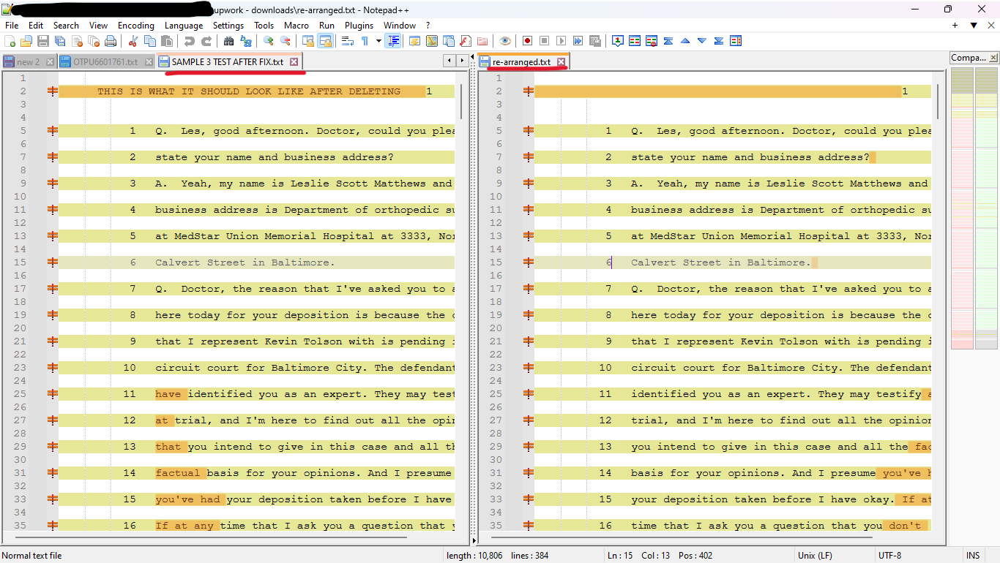

# 240929 Tom Hubbard

re-arrange the original text to be more compact and easily to read. the before & after requirements are shown as the [2 uploaded files](./upwork%20-%20downloads/).
[before](./upwork%20-%20downloads/SAMPLE%203%20TEST%20BEFORE%20FIX.txt)
[after](./upwork%20-%20downloads/SAMPLE%203%20TEST%20AFTER%20FIX.txt) .

## Program UI.
### Raw Mode.

### Word Wrap Mode.

## Requirement vs Result

## Demo
[Youtube demo here](https://youtu.be/GmWba-MpzHM?si=wzngl7X-wfR-fxvu) 
