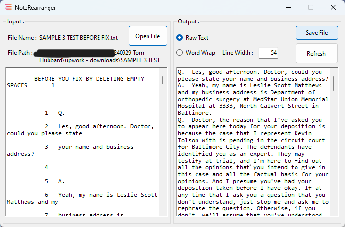
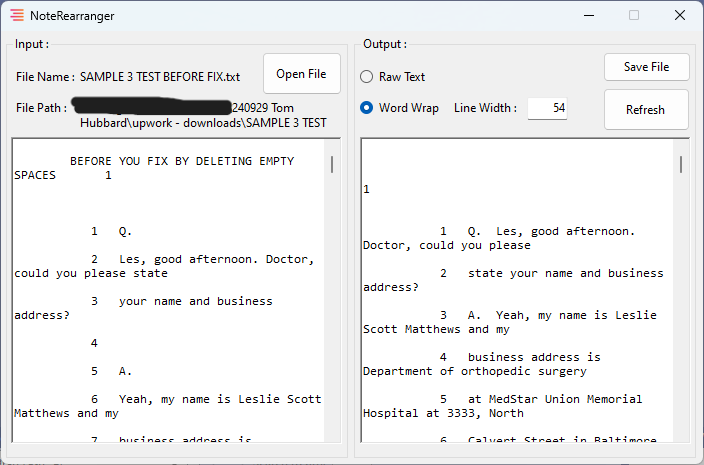
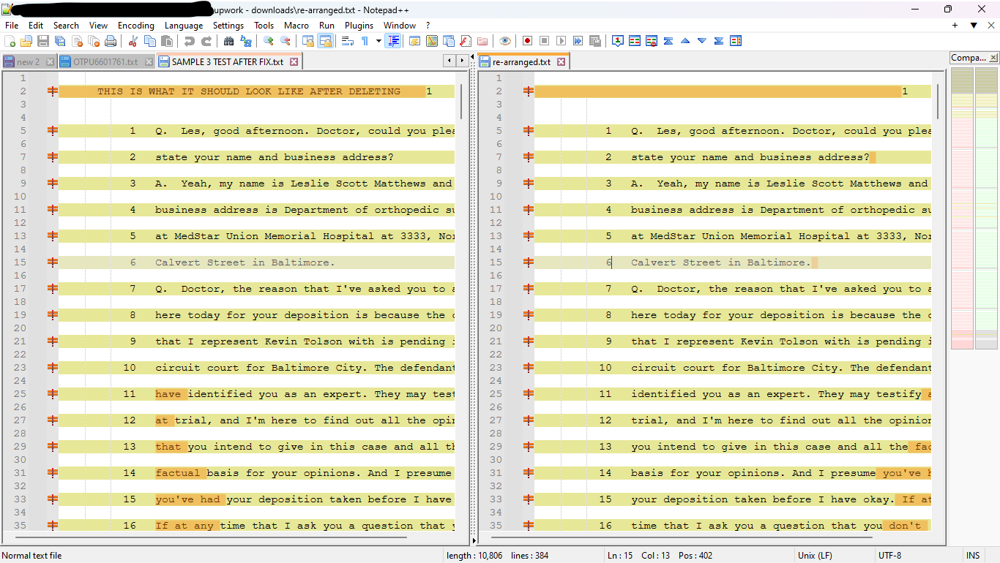

# Note Re-Arranger
*240929 Tom Hubbard*

this is an Upwork job which want to re-arrange the original text to be more compact and easily to read. the job owner shows the requirements as the 2 uploaded files, [before](./upwork%20-%20downloads/SAMPLE%203%20TEST%20BEFORE%20FIX.txt) & [after](./upwork%20-%20downloads/SAMPLE%203%20TEST%20AFTER%20FIX.txt) .

## The program UI.
1. raw mode.

2. word wrap mode.

## Requirement vs. Result

## Demo
[here](https://youtu.be/GmWba-MpzHM?si=wzngl7X-wfR-fxvu) 
